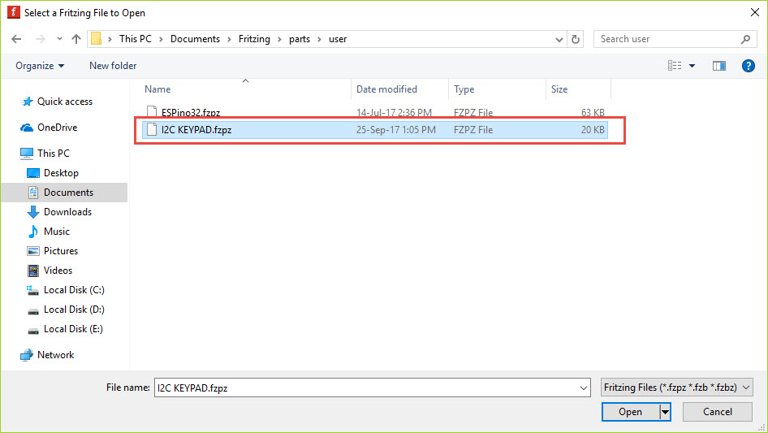

# I2C KEYPAD Fritzing Part

I2C KEYPAD Fritzing Part es el modelo de la placa I2C KEYPAD, que ThaiEasyElec se creó para usarse junto con el Programa Fritzing para que los usuarios creen
 Imagen del diagrama del circuito pueda  crear más conveniente
 
## Cómo instalar I2C KEYPAD Fritzing Part

1. Copie el archivo I2C KEYPAD.fzpz a -> C:\Users\computer name\Documents\Fritzing\parts\user

2. Programa abierto Fritzing
3. Seleccione la parte "MINE" (1)

4. Haga clic derecho, seleccione Importar (2)

5. Seleccione Archivo I2C KEYPAD.fzpz en -> C:\Users\computer name\Documents\Fritzing\parts\user y haga click en OPEN 

6. Aparecerá la parte ESPino32.
! [Funciones de pin] (doc / add_friz_step3.jpg)

7. Puede dibujar el diagrama del circuito según sea necesario

